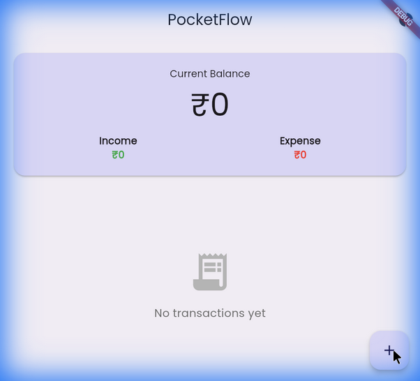
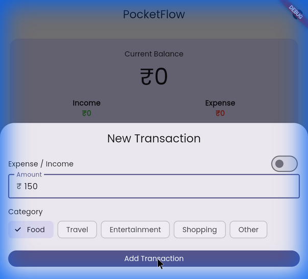

# PocketFlow 💸

**PocketFlow** is a smart, modern financial tracker designed to tell you what's *actually* safe to spend. Unlike traditional apps that just show a balance, PocketFlow calculates your "Daily Spendable" allowance based on your remaining budget term and committed bills.


## 🌟 Key Features

### 🧠 In My Pocket (Unique Logic)
Stop guessing. PocketFlow calculates your **Daily Spendable** amount by:
1.  Taking your **Current Balance**.
2.  Subtracting **Committed Bills** (Rent, Subscriptions, etc.).
3.  Dividing by the **Days Remaining** in your term.

### 🗓️ Flexible Terms
Not everyone gets paid on the 1st.
- **Fixed Income**: Set your payday (e.g., 25th of every month).
- **Flexible / Freelance**: Set a custom term (e.g., "This money needs to last 14 days").
- **One-Tap Refill**: Restart your term instantly when you get paid.

### 🧾 Dedicated Bills Manager
- Keep your committed money separate from your spending money.
- Add recurring or one-off bills.
- See your **Total Committed** amount at a glance.

### 📊 Smart Dashboard
- **Allowance Card**: See your daily limit and "Runway" (days left).
- **Balance Card**: Quick view of total funds.
- **Transaction List**: Clean history with income/expense indicators.
- **Visual Stats**: Pie charts to analyze spending categories.
- **Custom Categories**: Create, edit, and delete your own tags.
- **Transaction Notes**: Add optional details to every expense.

### 💾 Data & Backup (Universal)
- **Cross-Platform**: Works seamlessly on Android, iOS, and **Web**.
- **JSON Backup**: Deep copy for app migration with versioning.
- **Restore**: Securely import backups with built-in schema validation.
- **CSV Export**: Generate spreadsheet reports.
- **Flexible Options**: Choose between "Share" (Email, Drive) or "Save to Device/Download".
- **Organized Files**: Exports use readable timestamps (e.g., `pocketflow_backup_2023-11-23...`).

### 🎨 Modern UI
- **Responsive Layout**: Works on all screen sizes with smooth scrolling.
- **Interactive Animations**: Custom sliding toggles and transitions.
- **Haptic Feedback**: Satisfying tactile response for actions.
- **Dark Mode**: Fully supported system-aware dark theme.
- **Bottom Navigation**: Easy access to Home, Bills, Stats, and Settings.

---

## 🛠️ Technical Stack

- **Framework**: Flutter (Dart)
- **State Management**: Riverpod (v2)
- **Local Database**: Hive (NoSQL, fast & offline-first)
- **Architecture**: MVC / Layered (Data, Domain, Logic, UI)
- **Charts**: fl_chart
- **Icons**: flutter_launcher_icons

---

## 🚀 Getting Started

### Prerequisites
- Flutter SDK (3.0+)
- Dart SDK

### Installation
1.  **Clone the repository**:
    ```bash
    git clone https://github.com/joker0210G/pocketflow.git
    cd pocketflow
    ```

2.  **Install dependencies**:
    ```bash
    flutter pub get
    ```

3.  **Generate Adapters (Hive)**:
    Required for database models (`Transaction`, `AppSettings`, `Bill`).
    ```bash
    dart run build_runner build --delete-conflicting-outputs
    ```

4.  **Run the App**:
    ```bash
    flutter run
    ```

### Generating App Icons
To update the app icon, place your `my_logo.png` in `assets/images/` and run:
```bash
dart run flutter_launcher_icons
```

---

## 📱 Screenshots

| Home Dashboard | Add Transaction |
|:---:|:---:|
| <!-- Insert Home Screenshot -->  | <!-- Insert Add Screenshot -->  |

> *Note: Add your screenshots in a `docs/screenshots` folder or replace the links above.*

## 🤝 Contributing
1.  Fork the Project
2.  Create your Feature Branch (`git checkout -b feature/AmazingFeature`)
3.  Commit your Changes (`git commit -m 'Add some AmazingFeature'`)
4.  Push to the Branch (`git push origin feature/AmazingFeature`)
5.  Open a Pull Request

---

## 📄 License

This project is licensed under the MIT License - see the [LICENSE](LICENSE) file for details.

---
Built with 💙 using Flutter.
